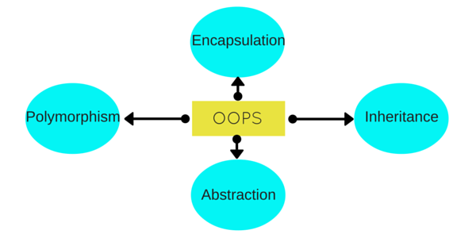
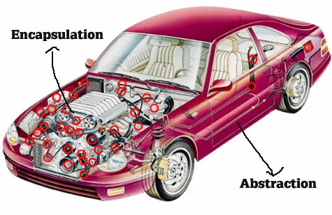

# The Four Pillars of Object Oriented Programming
In this post we are going to take a high level look at the four pillars of object oriented programming. If you just said to yourself ‘Pillars? There are pillars?”, then you are in the right place. Through code and real world examples we will illustrate what these principles mean conceptually and practically.

In order to understand the pillars of OOP let us first define what OOP is:

> Object Oriented Programming is a language model that is organized around objects rather than actions and data rather than logic.

To be clear, that does not mean we do not use actions and logic in our code(or at least we should), but that rather than coding out a set of linear instructions in which we pass function to function or input to output we instead build objects. We model things that have attributes. They hold specific types and quantities of data and have methods they can perform. This allows our objects to interact with each other in order to read, write, interpret, calculate, manipulate or otherwise interact with that data.

So how and why do we do all of this? That is where the four pillars come into play. Here they are:



A.P.I.E. Which is easier to remember. Because A Pie!


If you are like me then you saw that list and went, “Well… I definitely know what one of those means ¯\_(ツ)_/¯”. And to that I say, “Alas…you know so much more!”

So let us dive in and take a look at why these are fundamental to OOP and how you are already incorporating them into your code.

We are going to start with encapsulation(yes, out of order because they make more sense this way). Think of a car.

Most likely you thought of something along the lines of this:


Probably not this:


We keep all the inner workings of the car together encapsulated under the hood. The important stuff is stored there to keep it safe from the average user(non mechanics) which ensures the integrity of the system as it was designed. If you’ve ever incurred hefty mechanic fees after messing with something inside your engine then you understand the value and need for encapsulation. We don’t want this to happen to our code either.

Take this code block for example.

```ruby
class Person
  attr_reader :first_name, :last_name #=> These attr readers act like getter methods  
                                      #=> which allow us to access the instance variables

  def initialize(first_name, last_name, birthday)
    @first_name = first_name          #=> All the data is stored
    @last_name = last_name            #=> in the instance variables
    @birthday = Date.parse(birthday)      
  end

  def birthday                        #=> Functions related to that data
    @birthday.strftime('%B %d, %Y')   #=> live in the class as well.
  end
  
  

end

john = Person.new('John', 'Smith', '18/05/1986')

john.first_name # => 'John'
john.last_name # => 'Smith'
john.birthday # => 'May 18, 1986'
```

We have defined a simple Person class. We encapsulate the data(first name, last name, age) and the functions needed for that data(getter methods for names and a format method for date) inside the class. We have packaged all relevant information together and only the methods within that package can directly manipulate that information. This concept will lead us to further restrict access within our classes to not only maintain the integrity and security of our software but also to facilitate abstraction.

Abstraction and encapsulation are tightly related. Stepping back into the car analogy, when we interact with a car we only need to know that the gas is on the right, the break is on the left, put it in drive and the steering wheel tells the car where to go. This is abstraction. We are only showed the simplest possible interface and the non-essential information to that interface has been hidden.



This is ubiquitous in the code we write from a user clicking a button, and remaining blissfully unaware of event listeners waiting to invoke callback functions, all the way down to the gems and libraries we use ourselves. These are themselves abstractions of functionality we need to use but do not need to build from scratch. It reduces complexity and increases efficiency by making things more intuitive, modular and overall less complicated.

```ruby
class Person
  def initialize(first_name, last_name, birthday)
    @first_name = first_name
    @last_name = last_name
    @birthday = Date.parse(birthday)
  end
  
  def who_am_i?                             #=> We abstract these variables into
    "My name is #{first_name} #{last_name}" #=> into practical methods
  end                                           
  
  def how_old_am_i?
    "I am #{age} years old"
  end
  
  private #=> We further encapsulate by making data and methods private

    attr_reader :first_name, :last_name, :birthday
  
    def age
      Date.today.year - birthday.year
    end
    
end

john = Person.new('John', 'Smith', '18/05/1986')

john.who_am_i? #=> I am John Smith
john.how_old_am_i? #=> I am 31 years old
```

If we look at the above code snippet, based on our person class, we can see that some of the data and functionality has been abstracted. No longer do we have to call “first_name” and “last_name” on our person instance but rather can simply ask the object who it is or how old it is. It returns nicely formatted strings that interpolate the data we have stored or data we have calculated. The user does not need to see this, they only need a simple interface and a result. Additionally, we make our attr readers and age method private to further embody the encapsulation principle and protect access to data the user does not require.

Next up we come to inheritance. This is often the most easily understood because we are all examples of inheritance. If we go back to our Person class and add a new class, Child, that inherits from Person we can illustrate this point.

```ruby
class Person
  def initialize(first_name, last_name, birthday)
    @first_name = first_name
    @last_name = last_name
    @birthday = Date.parse(birthday)
  end
  
  def who_am_i?
    "My name is #{first_name} #{last_name}"
  end
  
  def how_old_am_i?
    "I am #{age} years old"
  end
  
  private
  
    attr_reader :first_name, :last_name, :birthday
  
    def age
      Date.today.year - birthday.year
    end
    
end


class Child < Person #=> We inherit from the Person class
  def initialize(first_name, last_name, birthday, grade)
    super(first_name, last_name, birthday)  #=> Common args are sent up the chain
    @grade = grade                          #=> Unique args utilize the local inititalize
  end

  def what_grade_am_in?
    "I am in the #{grade} grade"
  end
  
  private
    
    attr_reader :grade
    
end

jane = Child.new('Jane', 'Smith', '01/01/2011', "1st")

jane.who_am_i? #=> "My name is Jane Smith"          #=> Common Method 
jane.how_old_am_i? #=> "I am 6 years old"           #=> Common Method
jane.what_grade_am_in? #=> 'I am in the 1st grade"  #=> Unique Method
```

When we create a new class that utilizes inheritance we give our child class access to all the architecture of the parent class. As you can see in the example Jane can tell you who she is and how old she is, but she can also tell you what grade she is in. We are able to extend the functionality of a child class without duplicating all the code from the parent. It makes our code reusable and keeps us from repeating ourselves.

Lastly we have polymorphism. Surely intimidating at first, but if we take it back to high school English and break it down we simply get many(poly) forms(morph). Back to the auto lot.

Say we have this vintage civic:


And this Tesla Model X:


When we sit in the driver’s seat and push on the gas both cars go. But under the hood one is burning gas and the other runs on electricity. To the user both cars will move forward, but inside the engine different things are happening. This is the crux of polymorphism. Functions or methods that are named the same thing can do things differently. This makes our code easier to interact with. If we look back to our Person and Child classes:

```ruby
class Person
  def initialize(first_name, last_name, birthday)
    @first_name = first_name
    @last_name = last_name
    @birthday = Date.parse(birthday)
  end
  
  def who_am_i?   #=> This method is unaffected
    "My name is #{first_name} #{last_name}"
  end
  
  def how_old_am_i?
    "I am #{age} years old"
  end
  
  private
    attr_reader :first_name, :last_name, :birthday
  
    def age
      Date.today.year - birthday.year
    end
end


class Child < Person
  def initialize(first_name, last_name, birthday, grade)
    super(first_name, last_name, birthday) 
    @grade = grade                         
  end

  def what_grade_am_in?
    "I am in the #{grade} grade"
  end
  
  def who_am_i?   #=> We override this method in the child class
    "I'm #{first_name}, and I'm #{age} years old!"  
  end

  private

    attr_reader :grade

end

john = Person.new('John', 'Smith', '18/05/1986')
jane = Child.new('Jane', 'Smith', '01/01/2011', "1st")

jane.who_am_i? #=> "I'm Jane!"
john.who_am_i? #=> "My name is John Smith"
```

Children are not adults. Perhaps we can reflect that in our code. When you ask a child who they are, they may be a little more informal. They might overshare. If we override the ‘who_am_i?” method in the child class to only offer a first name but additionally offer an age, we still have not changed the interface with the code from the user perspective. We can call that method on an instance of the Person class or the Child class and both will respond. They will do so through different implementations and the output will be slightly different but to a user both work. It is polymorphic.

A last quick note about polymorphism is that, specifically in inheritance patterns such as this, one of the fundamentally useful aspects of this principle is that affecting or overriding a method in the child class does not change that same method in the parent class. This can be incredibly useful in creating more specialized behaviors down the inheritance chain.

These pillars keep our work organized, modular and maintainable. They stop us from repeating ourselves, keep our data safe and most importantly make it simpler for our colleagues and our users to interact with. They hold up the object oriented pantheon in all their doric glory so you don’t forget…


